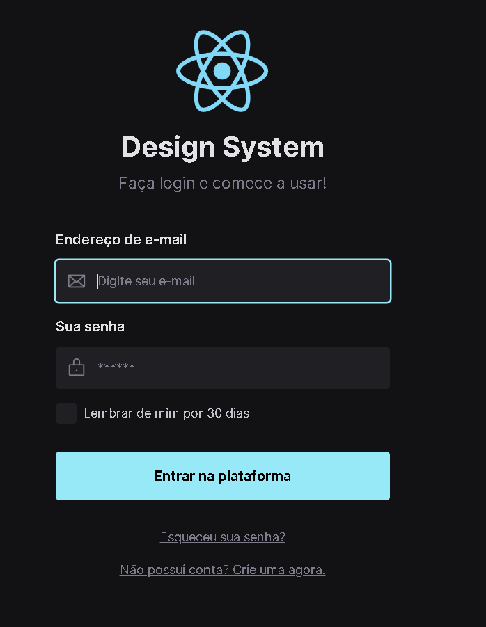

# Design System

# Lab React

[Rocketseat](https://www.youtube.com/c/RocketSeat) event.

> Design System with Figma, Storybook, Tailwind and React.

## Requirements:

- [Node](https://nodejs.org)
- [npm](https://www.npmjs.com/)
- [Git](https://git-scm.com/)
= [Github](https://github.com/)

## Tech Stack:

- [Figma](https://www.figma.com)
- [Storybook](https://storybook.js.org/)
- [Storybook Deployer](https://github.com/storybookjs/storybook-deployer)
- [Tailwind](https://tailwindcss.com/)
- [Radix-UI](https://www.radix-ui.com/)
- [React](https://pt-br.reactjs.org/)
- [TypeScript](https://www.typescriptlang.org/)

## Funcionalities

- Design System in Figma
- Documentation and build of the UI components using Storybook
- Deployment of the Storybook static page in GitHub Pages
- Home/Login Page with React